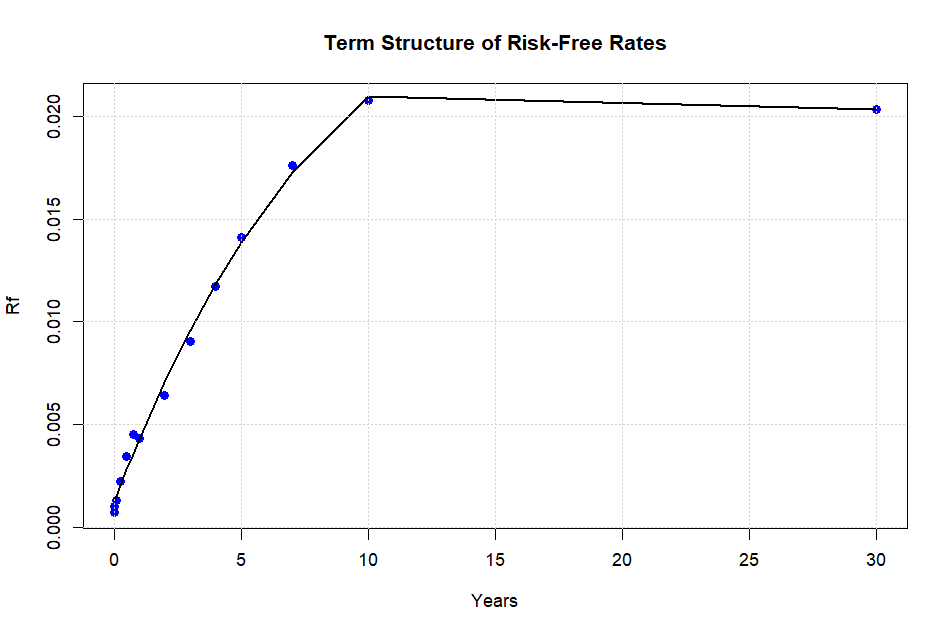

# Risk Management: European Book of Options on the SP500 
## Stats Methods for Financial Data (HEC Montreal)

The objective is to implement (part of) the risk management framework for estimating the risk of a book of European call options on the SP500 by taking into account the risk drivers such as underlying and implied volatility, given by the VIX. This is done through a rigourous theoretical and applied approach with the help of the R programming language, RStudio, and Git/Github. The following steps and approaches are taken: 

### 1. Data 
SP500, VIX, term structure of interest rates, traded options (calls and puts) 

### 2. Option Pricing
Automated options pricing using the given data, based on the Black-Scholes model and linear interpolation for the interest rates. 

### 3. Risk analysis approaches: 

**3.1. Approaches:** 

- One risk driver (SP500) and Gaussian modelling
- Two risk drivers (SP500 & VIX) and multivariate Gaussian modelling (MVGM)
- Two risk drivers (SP500 & VIX) and normal copula, student-t marginal modelling
- **Full approach:**
  - GARCH(1,1) with Normal innovations modelling for SP500 log-returns
  - AR(1) modelling for the VIX log-returns
  - Normal copula with normal marginals fitted to invariants residuals

**3.2. Risk metrics:** 

- Simulated returns distributions
- Simulated P/L distributions
- 95% Value at Risk (VaR) and 95% Expected Shortfall (ES) of profit-loss distribution of simulated values for 5 days ahead

### 4. Volatility Surface
Fit a volatility surface to the implied volatilities observed on the market (traded call and put options). The volatiliry surface is fitted by minimizing the absolute
distance between the market implied volatilities and the model implied volatilities.

### Authors
- Hair Parra 
- Alessio Bressan 
- Ioan Catalin

## SP500 vs VIX

## Term structure of risk-free rates

## P/L distribution of book of options (Full Approach) 

## Volatility Surface

(C) 2023
